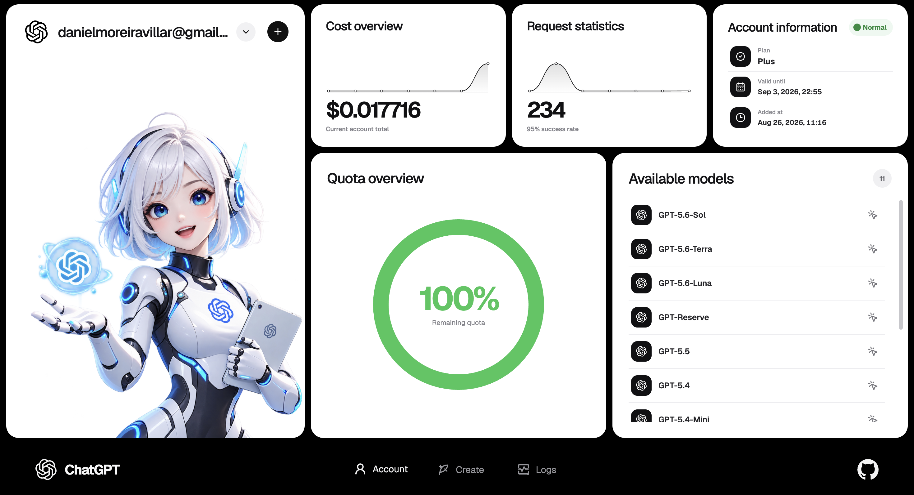
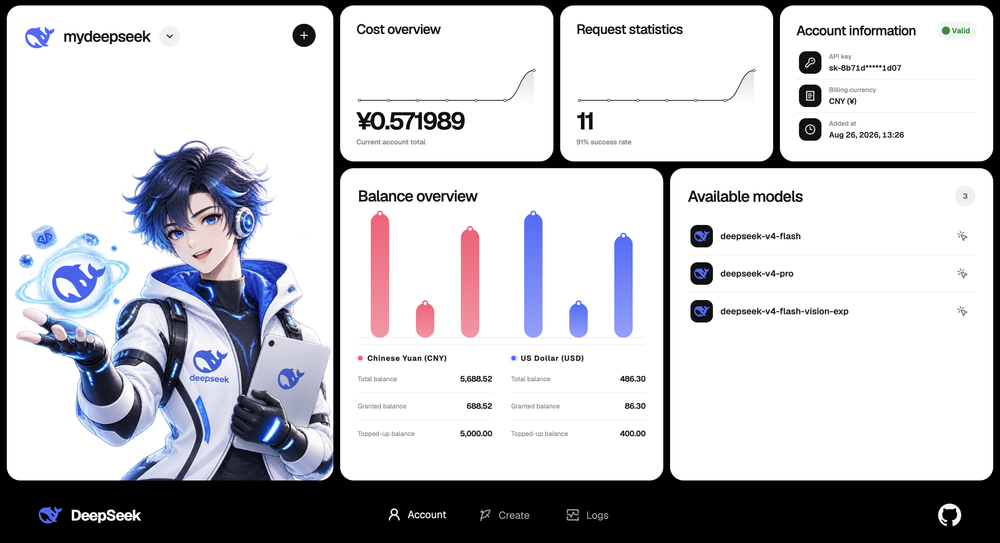
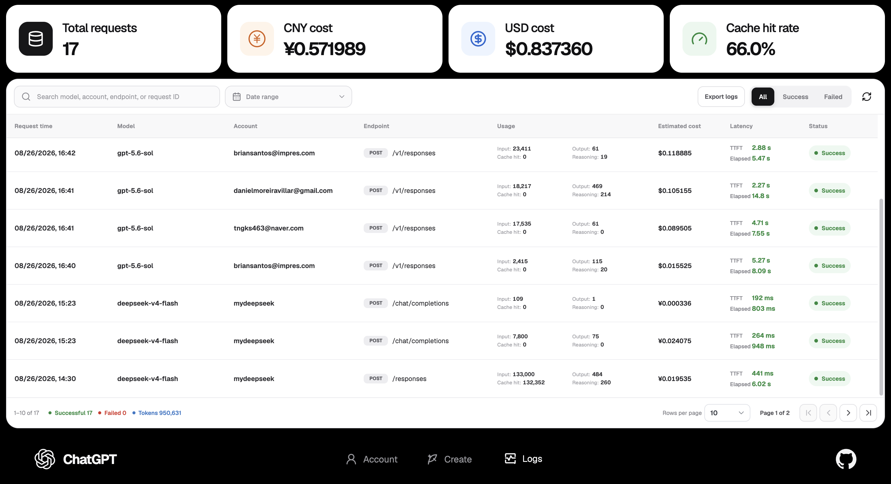
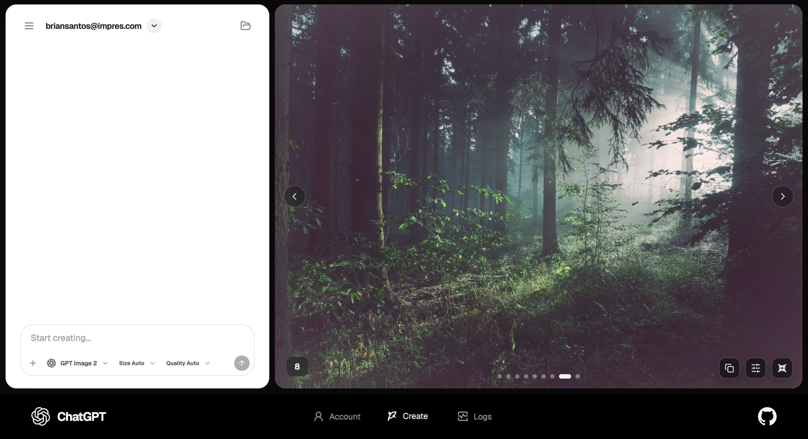

# StarBox

[English](./README.md) | [简体中文](./README.zh-CN.md)

StarBox 是一款本地运行的 ChatGPT/Codex 账号与 DeepSeek API Key 管理桌面应用，支持 Windows 与 macOS。

你可以使用 StarBox 管理凭证、查看额度与余额、浏览可用模型、统计请求和 Token 消耗，通过本地网关调用模型，将 DeepSeek 模型应用到 Codex 或 DeepSeek Harness，并进行图片创作。账号凭证、使用记录和创作内容均保存在本机。

## 操作手册

[查看 StarBox 操作手册](https://rcnavw2rdmby.feishu.cn/wiki/MkwFwO2bjiJQF6kJ9tZcaNJanud?from=from_copylink)

## 功能

- 管理多个 ChatGPT/Codex 凭证，支持浏览器登录和导入认证文件
- 查看 Codex 账号健康状态、额度、重置时间、套餐和可用模型
- 在本机加密保存多个 DeepSeek API Key
- 查看 DeepSeek 余额与模型目录
- 通过本地地址转发 Codex Responses API，以及 DeepSeek Responses/Chat Completions 请求
- 将选中的 DeepSeek 模型应用到 Codex 或 DeepSeek Harness
- 按提供商记录请求状态、耗时、Token 用量和预估费用
- 使用已连接的 ChatGPT/Codex 账号创建并管理图片创作会话
- 支持简体中文和英文界面

## 界面预览

### ChatGPT 账号



### DeepSeek 账号



### 请求日志



### 图片创作



## 下载

[下载 StarBox 最新版本](https://github.com/solnsu/StarBox_AITools/releases/latest)

- Windows：支持 64 位系统
- macOS：支持 Apple Silicon 与 Intel 芯片

## 本地开发

需要 Node.js 22 或更高版本。

```bash
npm ci
npm test
npm run build
npm run dev
```

Web 开发服务器运行在 `http://127.0.0.1:5173`，并将 API 请求转发至 `http://127.0.0.1:4312` 的本地服务。

桌面开发与打包：

```bash
npm run dev:desktop
npm run desktop:pack
npm run desktop:dist
```

Windows 安装包应在 Windows 环境构建，macOS 安装包应在 macOS 环境构建。桌面安装包自带运行环境，最终用户无需安装 Node.js。

## 本地数据与安全

- 桌面版数据保存在 macOS 的 `~/Library/Application Support/StarBox/` 或 Windows 的 `%APPDATA%\\StarBox\\`。
- 导入的账号凭证和 DeepSeek API Key 使用本机 AES-256-GCM 密钥加密保存。
- 服务仅监听 `127.0.0.1`。
- 凭证密钥不会通过列表或监控接口返回，也不会写入请求日志。
- 本地 API Key 可以在应用内立即轮换。

请勿提交生成的凭证、API Key、本地数据库或本地主密钥。

## 开源

StarBox 源代码采用 [Apache License 2.0](./LICENSE) 开源。按照许可证条款，可以使用、修改、分发和商业使用。

不得使用 StarBox 名称、Logo 或官方发行标识来暗示官方认可或官方身份。归属和品牌说明见 [NOTICE](./NOTICE)，参与贡献请参阅 [CONTRIBUTING.md](./.github/CONTRIBUTING.md)。

## 致谢

StarBox 的开发离不开优秀的开源项目和技术。详情请参阅[致谢名单](./docs/ACKNOWLEDGEMENTS.md)与[第三方软件声明](./docs/legal/THIRD_PARTY_NOTICES.md)。

感谢 [Linux.do](https://linux.do/) 社区对本项目的推广、反馈与支持。

## 法律、隐私与安全

- [最终用户许可协议（中英双语）](./docs/legal/EULA.txt)
- [最终用户许可协议（英文）](./docs/legal/EULA_EN.txt)
- [隐私政策](./docs/legal/PRIVACY.md)
- [安全政策与漏洞报告](./.github/SECURITY.md)

StarBox 是独立开发的第三方项目，与 OpenAI 或 DeepSeek 不存在隶属、赞助、授权或官方合作关系。“OpenAI”、“ChatGPT”、“Codex”和“DeepSeek”是其各自权利人的商标。

项目主页：https://github.com/solnsu/StarBox_AITools
